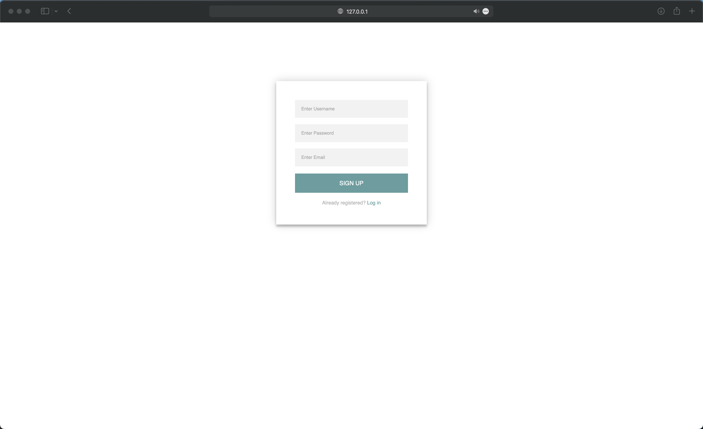
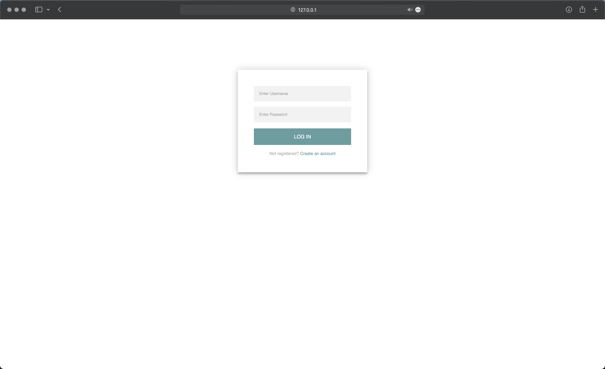
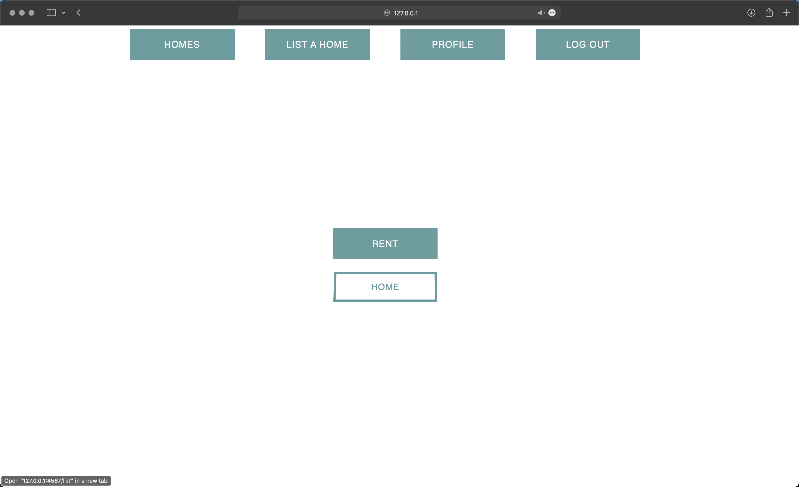
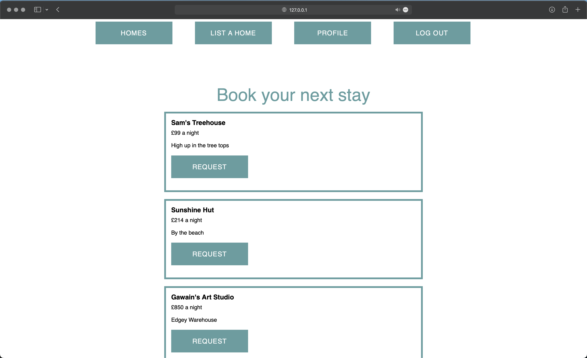
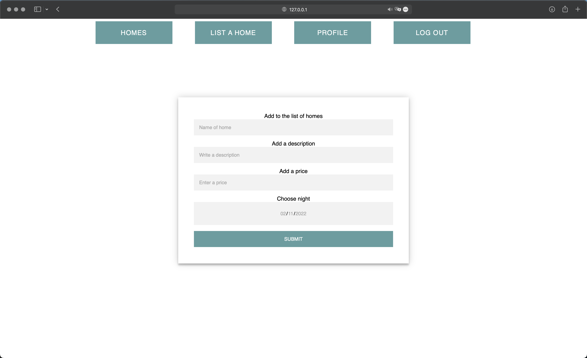
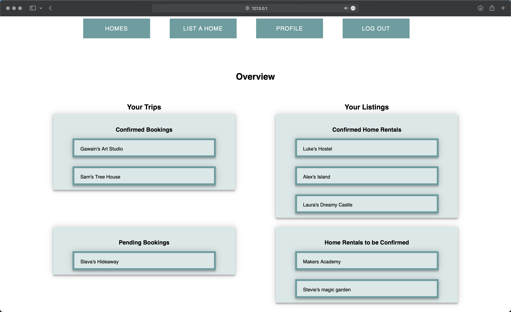

# MakersBnB

## Contributors

* [Sam Button](https://github.com/SamButton12)
* [Gawain Hewitt](https://github.com/gawainhewitt)
* [Alexandros Papagiannis](https://github.com/Alexandros91)
* [Laura Voss](https://github.com/laura-voss)
* [Slava Yates](https://github.com/amfibiya17)

## Description

This is a clone of AirBnB built using Ruby, Sinatra and PostgreSQL. It was a group project as part of Makers Academy and we named our version MakersBnB.
 

## Technologies Used

- [Ruby 3.0.2] As our coding language
- [Sinatra] Our DSL use for writing web apps
- [Capybara] For user testing
- [RSPEC] For unit testing
- [PostgreSQL] Our local database
- [CSS]
- [HTML]
 

#### Organisational & Planning Tools

- [Trello](https://trello.com/en) | Kanban tool
- [Slack](https://slack.com/intl/en-gb/) | Communication tool
- [Miro](https://miro.com/) | for Wireframing
 

## Card Wall

 

## Wireframes

 

## Team approach

* Standups every morning at 10:00
* Retro at 5:30 every evening
* Pair programming throughout the whole project
* Regular check-ins with team members to make sure nobody was left behind
* Trello board for distributing work and staying on track
 

## Demo

#### Signup

#### Login

#### Home

#### Homes

#### List a Home

#### Profile

 

## How to install and setup

### How to run locally

1. Fork this repository
2. Clone your fork to your local machine
3. Type `bundle install` to install dependencies

### Database setup
1. Connect to psql
2. Create the database using the psql command CREATE DATABASE makersbnb;
3. Connect to the database using the pqsl command \c makersbnb;
4. Run the query we have saved

### Start local server

1. Type `ruby app.rb` in terminal to run local server
2. Browse to local address given in terminal
