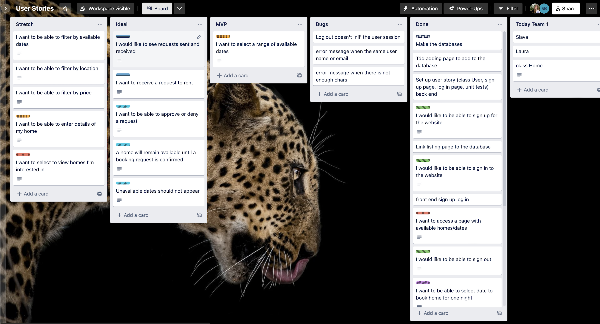
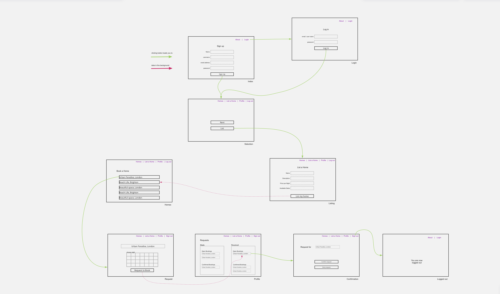

# MakersBnB

## Contributors

* [Sam Button](https://github.com/SamButton12)
* [Gawain Hewitt](https://github.com/gawainhewitt)
* [Alexandros Papagiannis](https://github.com/Alexandros91)
* [Laura Voss](https://github.com/laura-voss)
* [Slava Yates](https://github.com/amfibiya17)

## Description

This is a clone of AirBnB built using Ruby, Sinatra and PostgreSQL. It was a group project as part of Makers Academy and we named our version MakersBnB.

## Technologies Used

- [Ruby 3.0.2] As our coding language
- [Sinatra] Our DSL use for writing web apps
- [Capybara] For user testing
- [RSPEC] For unit testing
- [PostgreSQL] Our local database
- [CSS]
- [HTML]

#### Organisational & Planning Tools

- [Trello](https://trello.com/en) | Kanban tool
- [Slack](https://slack.com/intl/en-gb/) | Communication tool
- [Miro](https://miro.com/) | for Wireframing

## Card Wall

## Wireframes

